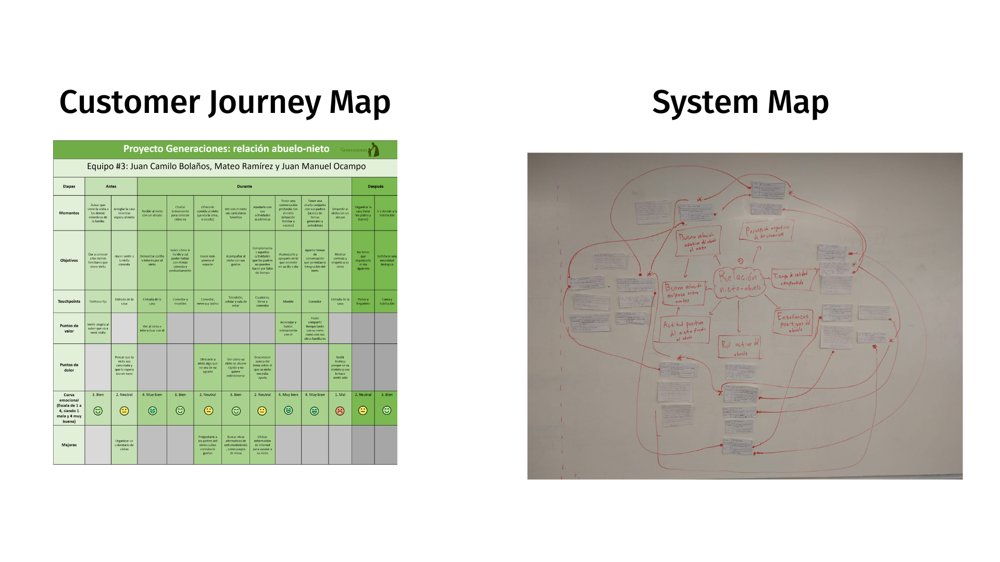
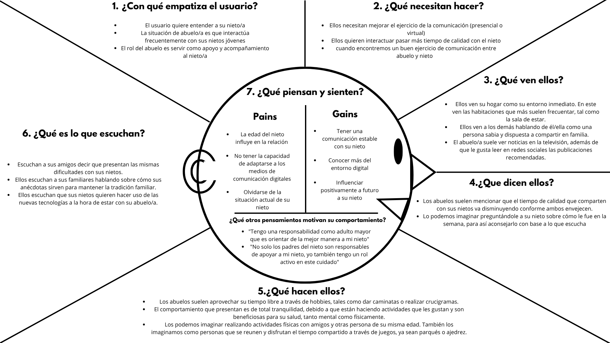

## The context

The brief arrived wide open: research older adults within the family. We
could have gone anywhere with that, to health, to autonomy, to housing. Our
team of three chose the relationship between grandchildren and
grandparents. It was my first research project of the degree, in the second
semester of Interactive Design.

Two pieces of data justified narrowing it down. By 2035, Medellín will be
the Colombian city with the largest population of older adults (Cardona,
2019). And between 2005 and 2018 households in Medellín went from 3.6 to
2.9 members on average (Medellín Cómo Vamos). Two curves crossing each
other: **there are more grandparents every year and less shared home with
them.** What is left in between is a bond that no longer holds up on living
together alone.

## The key design decision

The brief talked about a person. We decided to study a relationship, and **a
relationship has two ends**: asking only the grandparent gave us half the
bond, probably the more agreeable half.

That meant duplicating every instrument. The interview guide was written
with each question marked by profile, some addressed to the grandchild and
others to the grandparent, and several raised the same matter from both
sides: we asked the grandparent how they create a positive space to be with
their grandchild; we asked the grandchild whether they see their grandparent
as someone who can support them emotionally. That is why two user personas
came out of it and not one: Mariana, 14 years old, and María Elena, 61.

:::figura{ancho ampliar}

Comparative persona cards built for the project: Mariana (granddaughter) and María Elena (grandmother). The contrast between their profiles showed how both experience the same communication gap from different angles.
:::

The crossover produced the most useful material of the whole project. Both
describe the same friction and each blames the other's habit: the
grandmother says her granddaughter would rather be on her phone than talk
during the visit; the granddaughter says her grandmother barely uses social
media and prefers to meet in person. With only one of those two interviews,
that clash never surfaces.

## The process

We followed a sequence of six steps: literature review, problem definition,
implementation of the methods, analysis of what we collected, synthesis and
the framing of the design challenge. Before going into the field we set
three objectives, and that is what kept the research from scattering: to
understand the two main attitudes a grandparent takes when relating to their
grandchild, to identify the five factors that affect that relationship in
the long term, and to recognise whether the impact on the grandchild is
positive or negative.

We used eight methods: stakeholder map, interviews, cultural probes,
customer journey map, system map, user personas, empathy map and
infographic. Two did the heavy lifting.

The **cultural probes** were a seven-day booklet we left in the
grandparents' homes for them to fill in on their own, with nobody watching:
what do you usually do in your free time, what activities do you do with
your grandchild, which of these people can you talk to comfortably, draw how
you see your grandparent. Visual selection and drawing tasks rather than
writing, because participation had to hold up for a full week. A one-hour
interview collects what a person remembers; seven days in their home collect
what they do.

:::figura{ancho ampliar}

Sample of the seven-day cultural probes activities and photographs of direct field work in the participating older adults’ homes.
:::

The **customer journey map** charted a complete visit, from the heads-up
phone call to the goodbye, with its emotional curve. That is where the
finding no interview had given us appeared: the lowest point of the visit is
not a misunderstanding or an awkward silence, it is the end. The grandparent
feels sad because the grandchild is leaving and that makes them feel alone,
so the moment that closes the memory of the day is the worst one of all. We supplemented this tool with a system map to connect the older adult’s attitude with active support networks and quality time.

:::figura{ancho ampliar}

Joint display of the emotional journey map during the visit (left) and the physical whiteboard system map (right) used to structure relationships between stakeholders and value drivers.
:::

## What we found

The synthesis closed on nine findings. The ones that weighed most:

- **Communication is the main factor.** Not how often they visit, not how
  they are related: what defines the relationship is how they talk to each
  other. And mutual knowledge makes it easier, so the thing feeds itself:
  the more they know each other the better they communicate, and the better
  they communicate the more they know each other.
- **The grandparent's attitude determines the quality of the shared time.**
  That is where the two attitudes we were looking for came from, the
  inattentive grandparent and the committed one. The difference is not in
  how many hours they spend together, but in what the grandparent does with
  those hours.
- **Grandparents take an active role, not a backup one.** They see
  themselves as responsible for supporting and caring for their
  grandchildren, and they expect to be treated the way they treat them.
- **Grandchildren weigh that relationship as heavily as the one with their
  parents.** And 3 out of 4 grandchildren surveyed consider their
  grandparent's teachings valuable for their future.

The wearing down showed up too: according to the grandparents, the older the
grandchild the more independent they become and the less time they spend
with them. The bond does not break, it thins out. We synthesised all these experiences and friction points in an empathy map focused on the older adult’s perspective.

:::figura{ancho ampliar}

Seven-sector empathy map consolidating the emotional perspective, needs, and barriers experienced by older adults when interacting with their grandchildren.
:::

> "We spend a lot of time together. We really like watching television and talking"
> — A granddaughter's testimony

## The outcome

The final deliverable was an infographic gathering the nine findings, the
testimonies from both sides and the figure about the teachings, and on top
of it a question: how might we strengthen verbal communication between
grandchildren and grandparents, taking digital media into account?

:::figura{ancho ampliar}

Final infographic gathering the nine research findings, integrating testimonies from both grandparents and grandchildren, and framing the central design challenge.
:::

**The project closes there, on the question, and that was the deliverable.**
We did not build an app or a service, because the scope was the discovery
phase and its product is a well-grounded design challenge, which is what
lets another team start designing without researching all over again. The
question did not come out of a brainstorm: it came out of the first finding,
and that is why it points at communication and not at how often they visit,
which is what we would have gone after had we started from intuition.

One limitation worth stating: both user personas were built on a profile
from a single neighbourhood and a single socioeconomic bracket of Medellín.
The findings describe that context, not the whole city.

## What I learned

Before going into the field we wrote five hypotheses. One of them said that
grandparents interfere passively in their grandchildren's lives because the
parents' role is more dominant. **The data proved it wrong**: grandparents
take an active role, and grandchildren weigh that relationship as heavily as
the one with their parents. Having written the hypothesis down beforehand is
exactly what let me see I was wrong; had we kept it to ourselves, the
mistake would have passed for a finding.

It was my first research project and it left me a habit I still use: state
what I think is going to happen before measuring it. When the assumption is
written down, the data that contradicts it is information. When it is not,
you just find what you already thought.
