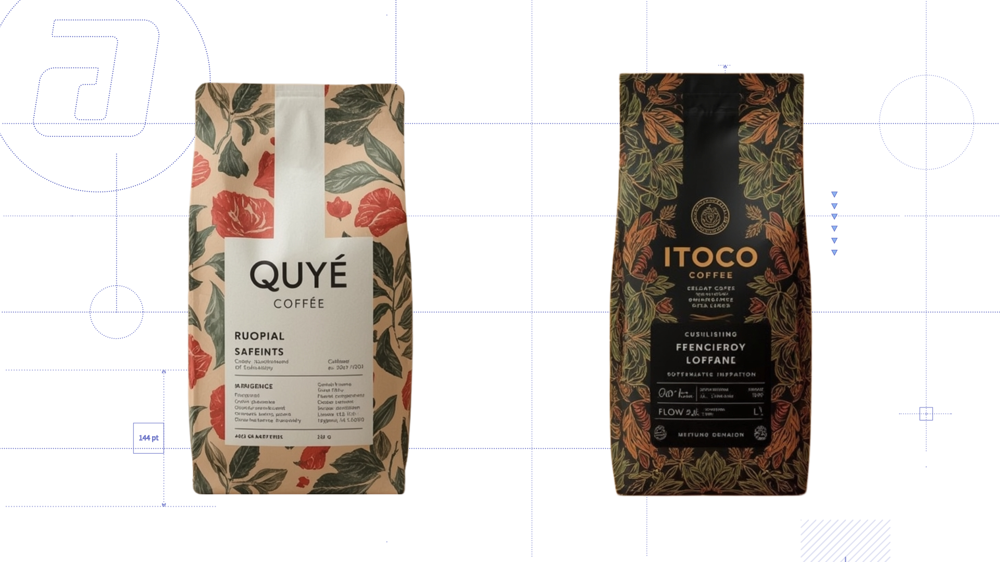

## The context

Alico is a flexible packaging company from Medellín. For its presence at
Cafés de Colombia Expo 2025 (Bogotá), the innovation team wanted to offer
attendees, coffee brand owners, something more memorable than a brochure:
the chance to *see* their own brand on a package, generated with AI from
their vision.

The project was developed together with Alico's IT team during my
innovation internship.

## The key design decision

The challenge wasn't technical but one of translation: how do you turn the
blurry vision a coffee grower has of their brand into instructions an AI
model can execute well?

The answer was to design the form as a creative brief interview: instead of
asking "describe your packaging", the 19-step journey asks for the brand's
name, its cultural references (rural farming culture? premium international
brands?), its differentiating factor, and asks the user to rate graphic
elements according to Gestalt principles: proximity, similarity, closure
and continuity. Each answer becomes a concrete parameter for the
generation.

:::figura{ancho ampliar}

Interface of the interactive creative brief form designed for the Cafés de Colombia Expo 2025 trade fair, where coffee growers defined their brand’s vision in 19 steps.
:::

## What I designed

- The form's visual experience: a step-by-step journey with Alico's
  identity and the warmth of the coffee world, designed to be completed in
  the context of a trade fair
- An editable summary at the end, so the user can review their answers
  before submitting
- The n8n automation flow that receives each response, sends it to the
  Leonardo API (combining different image generation models) and delivers
  the generated packaging straight to the participant's inbox

## The process

It was joint work with Alico's IT team: the form was custom built with the
fair's identity, and n8n orchestrated the connection between the answers,
the generation models and the email delivery. My contribution focused on
making the journey feel like a brand conversation and not a survey, and on
having the automation run on its own: I wasn't in Bogotá, and the system
served the fair's attendees without me.

:::figura{ancho ampliar}

Specialty coffee packaging generated automatically with AI (“QUYÉ COFFEE” and “ITOCO COFFEE”) from the interactive brief completed by fair attendees.
:::

## The outcome

The fair experience was the starting point of something bigger: the concept
evolved into a platform where Alico's clients upload their logo and view
realistic renders of their brand on different types of packaging. That leap
sped up decision-making in pre-sales and reduced the dependence on manual
renders.

:::figura{ancho ampliar}

Interface of the evolved pre-sales web platform for Alico S.A.S BIC, allowing clients to upload their logo and select different packaging formats.
:::

:::figura{ancho ampliar}

Realistic renders generated by the evolved platform applying logos and patterns onto spouted Doypack pouches and thermoformed food containers.
:::

## What I learned

Artificial intelligence has opened up new ways for companies to interact
with their customers. This project showed me that concretely: the same
technology worked as an experience that surprises a coffee grower at a fair
and as a pre-sales tool that saves manual renders. The value isn't in the AI
model, but in the experience designed around it.
