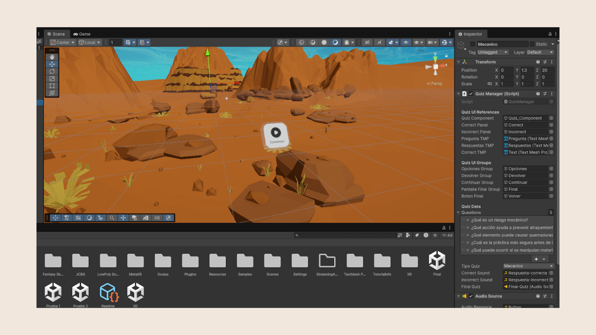
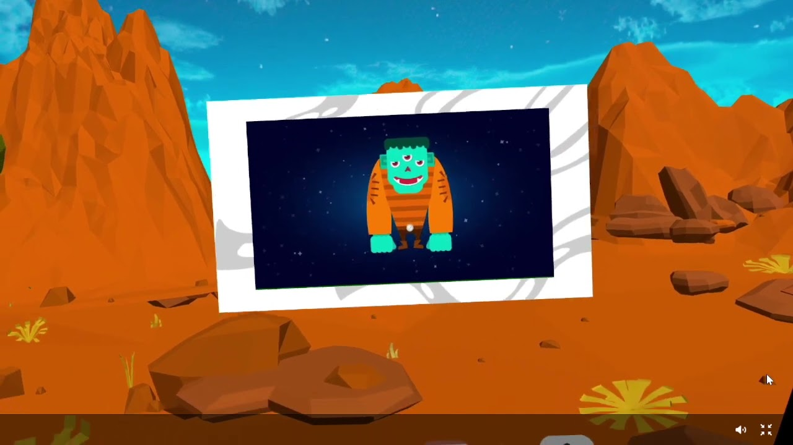

## The context

At Alico, operators are 65% of the workforce, and their training was done
through in-person talks and workshops: methods that interrupt production,
require moving away from the work area and depend on each instructor's
judgment, at around 10 hours a year per operator. The innovation team
wondered whether extended reality could rethink that model, and that became
my internship project: answer the question with method, not intuition.

## The key design decision

Invert the commute: instead of taking the operator to the training, take the
training to the workstation with a Meta Quest 3s headset. And instead of
creating content from scratch, adapt a course that already existed and
worked: "Planeta SST", from the company's learning platform. The shift was
from passive learning (watching videos on a PC) to active, immersive
learning.

:::figura{ancho ampliar}

Page from the methodological guide delivered to the organization, detailing safety instructions, setup, and onboarding to the Meta Quest 3s headset for operators.
:::

## The process

I followed the full Design Thinking cycle, using the innovation team's
toolbox:

**Empathize.** Semi-structured interviews with the Occupational Health and
Safety, Learning and Development, and TPM teams.

**Define.** The findings were synthesized into focal points: bring the
training to the workstation so production doesn't stop, standardize the
content and keep the sessions short and flexible. The company's risk matrix
showed that 374 of the 569 identified risks belonged to the categories
chosen for the prototype: the scope wasn't arbitrary.

**Ideate.** With the SCAMPER technique we defined the course's
transformations: from the PC to the headset, from passive to active
learning, a unified quiz with a game show dynamic, subtitles because of how
hard it is to hear on the plant floor.

:::figura{ancho ampliar}

Official SCAMPER template from Alico’s innovation toolbox alongside field ideation photos, detailing content adaptation, captions for plant noise, and gamification.
:::

**Prototype.** A medium-fidelity prototype in Unity: the risk characters
from the original course (housekeeping risk, physical load, mechanical
risk) now live in an immersive environment with real footage of the plant,
an interactive quiz, a tracking dashboard in Looker Studio and data
automation with n8n.

:::figura{ancho ampliar}

Development interface in the Unity editor displaying the 3D desert planet scene, the Quiz Manager component inspector, and the asset structure for the immersive experience.
:::

**Validate.** A walkthrough of the prototype with 9 company employees,
evaluated with the same satisfaction survey used by the corporate learning
platform.

## The outcome

The mini-course is completed in 5 minutes on average. The average score on
the assessments was **4.32** and overall satisfaction, **4.9/5**. All
participants strongly agreed that the course was practical and
understandable, and 8 out of 9 that the navigation was simple. The project closed with the delivery of
the methodological guide: a document that steers how to implement extended
reality in the organization's training, beyond this prototype.

:::figura{ancho ampliar}

Interactive Looker Studio dashboard fed via n8n automations, recording individual performance for the 9 evaluated employees and the final average score of 4.32/5.
:::

:::video{youtube="EM_7Clp5BJc" titulo="Virtual Reality Training Prototype — Planeta SST"}

Demonstration of the immersive Planeta SST virtual reality training prototype developed in Unity for Meta Quest 3s headsets.
:::

## What I learned

This project let me put everything I learned in my degree into practice in an
organizational setting with real challenges: user research, prototyping,
disruptive thinking. And it gave me clarity about the kind of
projects I want to keep growing in: where research and technology meet to
change how people work.
