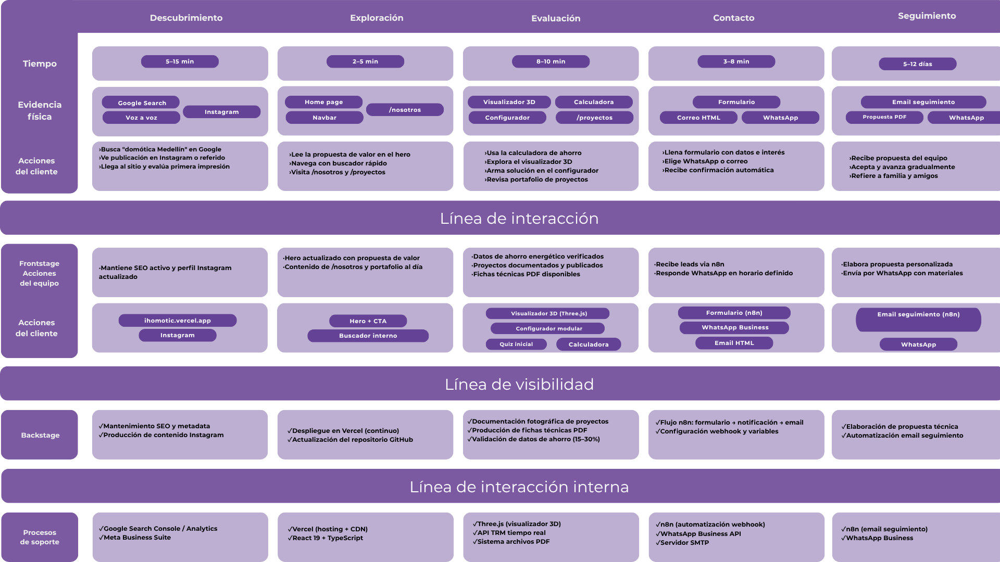
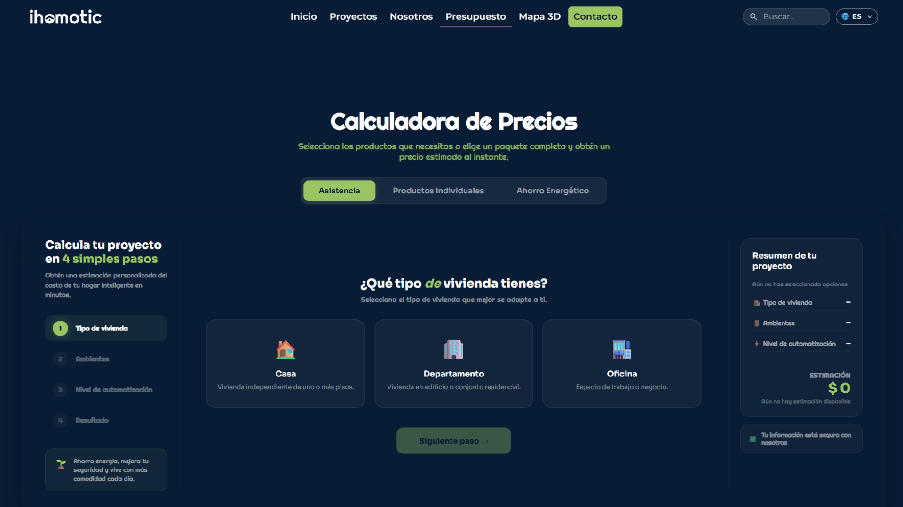
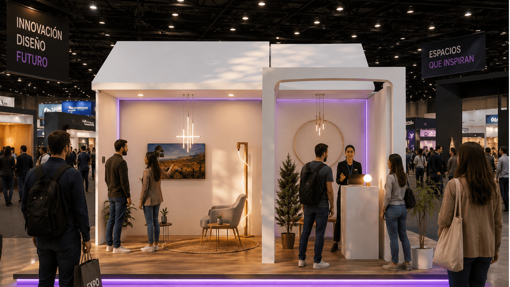
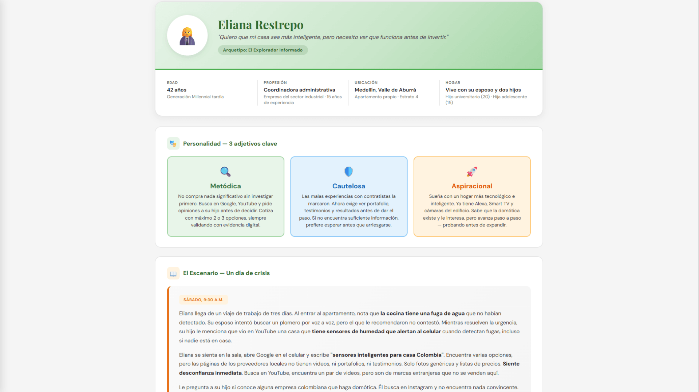

## El contexto

i-Homotic es una empresa colombiana de domótica con una propuesta técnica
sólida: hardware y software de fabricación nacional, sin mensualidades y con
integración de asistentes de voz. Su problema no era el producto sino la
visibilidad: los clientes llegaban solo por voz a voz, y cuando un
interesado pedía "ver la página web" antes de conversar, no encontraba nada
y descartaba a la empresa antes de empezar.

Este fue nuestro proyecto de último semestre en Diseño Interactivo (EAFIT):
un equipo de 6 personas, un cliente real, y criterios de éxito definidos por
el propio fundador. Mi rol combinó la investigación con usuarios, el diseño
de las experiencias interactivas del sitio y buena parte de la coordinación
del equipo.

## La decisión de diseño clave

Lo dijimos desde la justificación del proyecto: **el reto no era tecnológico,
era comunicativo**. Las 15 entrevistas de investigación definieron al usuario
objetivo: el "Explorador Informado", un propietario de 30 a 55 años que
valida digitalmente a los proveedores antes de contratarlos. Y dejaron un
patrón determinante: la gente no cree en la domótica por lo que le cuentan,
sino por lo que puede probar; y adopta por expansión gradual, empezando
pequeño.

Por eso el sitio no informa: **deja experimentar**. Ahí entraron los
elementos interactivos que diseñé: una calculadora de presupuesto y ahorro
energético que reduce la percepción de riesgo económico antes del primer
contacto, y un mapa 3D explorable de una vivienda automatizada, construido
con Three.js, donde el usuario recorre los espacios, ve qué dispositivos
tendría cada uno, y desde ahí mismo pasa al contacto con un "quiero esto en
mi casa".

:::figura{ancho ampliar}

Service Blueprint del sitio web: mapeo de interacciones, evidencias físicas y procesos de soporte para convertir la curiosidad inicial del Explorador Informado en contacto directo.
:::

## Lo que entregamos

El proyecto entregó un ecosistema completo de comunicación:

- **Sitio web** de seis vistas, bilingüe ES/EN, con las experiencias
  interactives integradas y publicado en producción

:::figura{ancho ampliar}

Calculadora de precios y presupuesto en cuatro pasos integrada en el sitio web para reducir la percepción de riesgo económico antes del primer contacto.
:::

:::enlace-vivo{href="https://i-homotic.vercel.app/" etiqueta="Visitar sitio web de i-Homotic" estado="produccion"}
El sitio web oficial está publicado en producción con el catálogo de soluciones de domótica, la calculadora interactiva de presupuesto y el mapa 3D.
:::

- **Propuesta de stand** para la Feria del Diseño de Plaza Mayor: 7×7
  metros, recorrido por estaciones con dispositivos reales manipulables, más
  el documento técnico de implementación y un modelo 3D a escala navegable
  en la web

:::figura{ancho ampliar}

Propuesta espacial para la Feria del Diseño de Plaza Mayor: stand de 7×7 metros estructurado como una vivienda habitable para experimentar los dispositivos en vivo.
:::

:::enlace-vivo{href="https://eafit-enfasis-ux.github.io/I-Homotic-Stand/" etiqueta="Explorar modelo 3D del stand" estado="demo"}
Se puede recorrer la escala tridimensional del stand directamente en el navegador a través del prototipo interactivo.
:::

- **Manual de marca** de 18 páginas como fuente única de identidad para
  todos los canales

Además de las experiencias interactivas, participé en las entrevistas de
investigación, integré el modelo 3D del stand a la web, diseñé mockups de
redes sociales según el manual de marca e hice iteraciones del modelo del
stand (el modelo final fue de un compañero del equipo).

## La validación

Se hicieron 39 sesiones con 17 participantes: paseo cognitivo por tareas
sobre el sitio y escala Likert para los tres entregables. Los resultados
guiaron correcciones concretas, y también dejaron hallazgos incómodos que
reportamos tal cual: la tarea de "entender con qué solución empezar con poco
presupuesto" fue el cuello de botella del recorrido, y la documentación de
usos incorrectos del manual de marca obtuvo 2.4/5. Ambos se convirtieron en
mejoras priorizadas.

:::figura{ancho ampliar}

Ficha de arquetipo del «Explorador Informado» definida durante la investigación con usuarios: perfil de 42 años, metódico y cauteloso que exige validación digital antes de contratar.
:::

## El resultado

Los criterios de éxito definidos por el fundador se cumplieron: el sitio
pasó el filtro de validación digital con **los 16 participantes** del perfil
objetivo, y la empresa quedó con material de presentación formal listo:
sitio en producción, manual de marca y modelo 3D del stand.

En la escala Likert, los tres entregables superaron el umbral de 4.0:

- **4.8** en la disposición a agendar una visita
- **4.6** en la claridad pedagógica, sin tecnicismos
- **4.6** en la utilidad de las experiencias interactivas para imaginar la
  solución en el propio hogar
- **5.0** del stand en generar curiosidad por la marca y en comunicar que la
  domótica es accesible, no solo para casas de lujo

> "Está muy bonito, se ve profesional. Me encantó el mapa."
> — Participante de validación

## Lo que aprendí

Trabajar con un cliente real que definió sus propios criterios de éxito
cambió mi forma de entender el diseño. En la universidad, el éxito lo define
una rúbrica; aquí lo definía el fundador, con metas concretas: pasar el
filtro de validación digital, quedar con material de presentación formal.
Eso obligó a diseñar con un norte verificable: cada decisión tenía que
responder a "¿esto nos acerca al criterio?" y no a "¿esto se ve bien?".

Aprendí que los criterios del cliente no limitan la creatividad: la enfocan.
Y que reportar el cumplimiento contra esos criterios con transparencia,
incluyendo lo que quedó fuera del alcance y lo que salió mal evaluado,
construye más confianza que aparentar una entrega perfecta.

