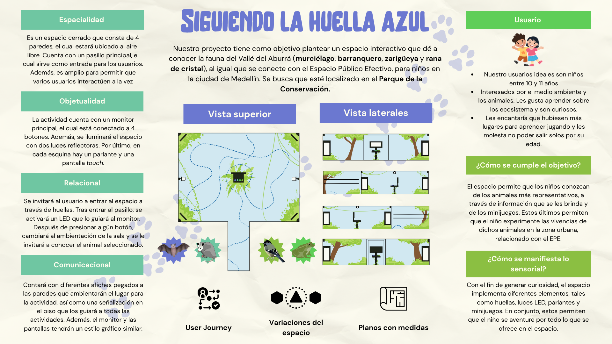
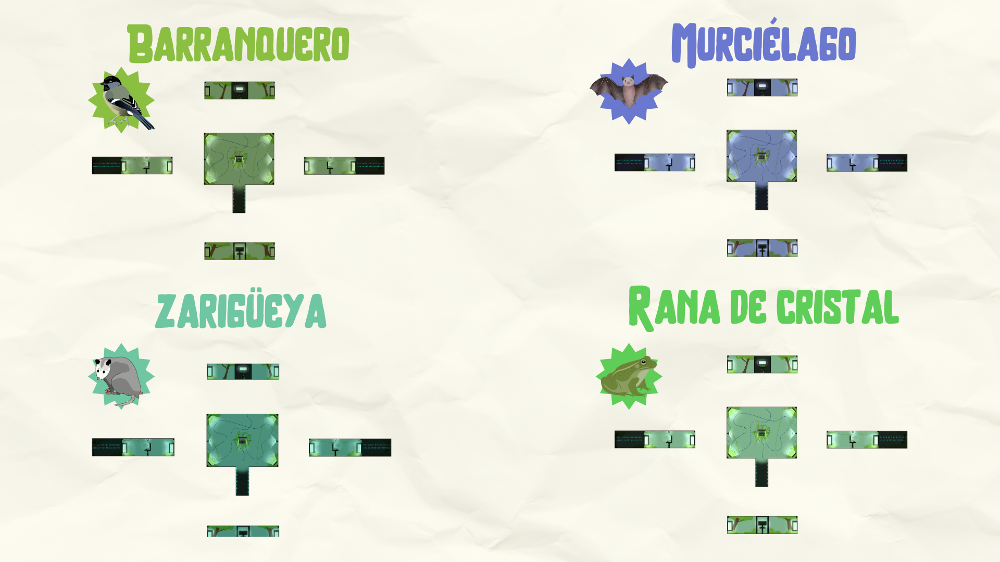
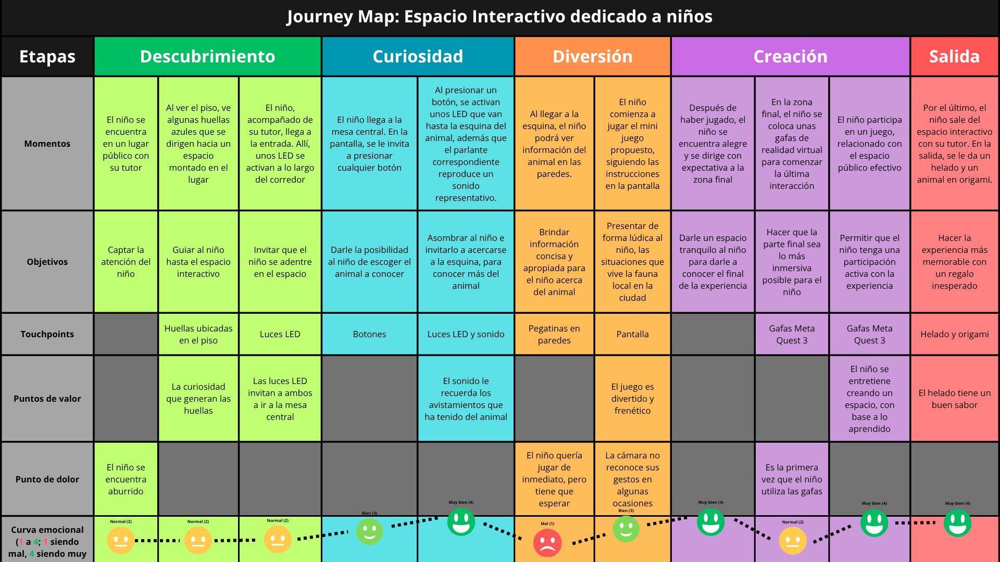
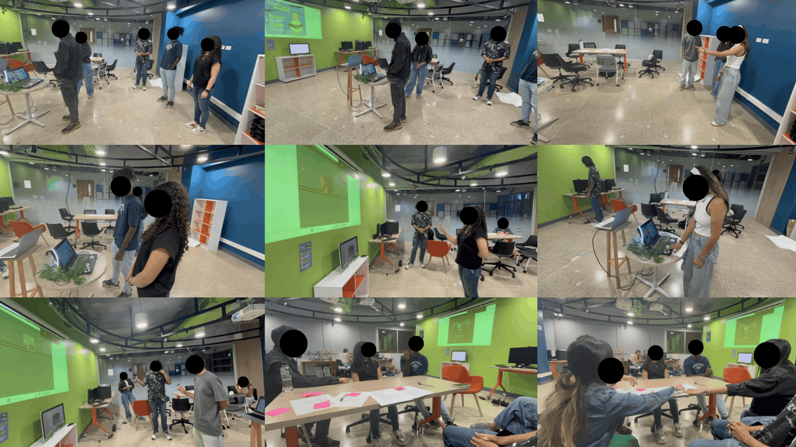
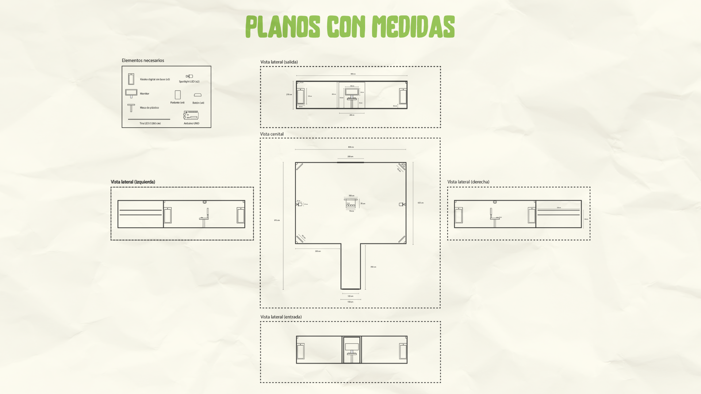
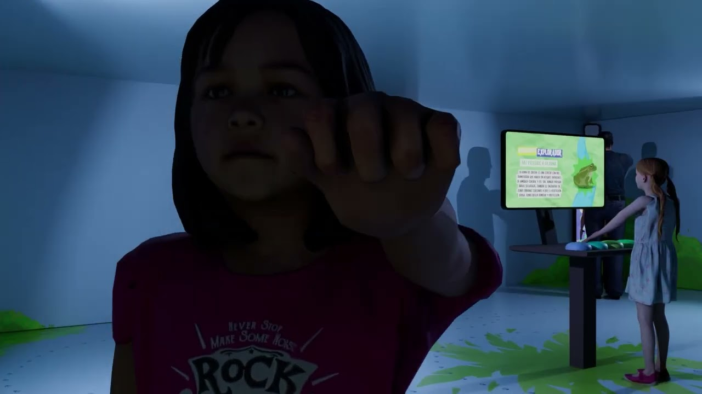

## El contexto

¿Cómo logras que un niño de Medellín se interese por el murciélago, el
barranquero, la zarigüeya o la rana de cristal, los animales con los que
comparte ciudad sin saberlo? Ese fue el reto de este proyecto académico en
equipo de 3: diseñar "Siguiendo la huella azul", una instalación interactiva
temporal propuesta para el Parque de la Conservación, dirigida a niños de 8
a 11 años y conectada con el concepto de Espacio Público Efectivo. Lideré
el equipo y me encargué del prototipo funcional completo, el render del
espacio y buena parte de la definición de la experiencia.

La propuesta completa define un espacio de 8.5 × 9.75 metros donde unas
huellas azules en el piso guían al niño hasta un monitor con botones
físicos para elegir un animal; la selección transforma la ambientación
completa (luz y sonido) y activa minijuegos en pantallas táctiles que le
permiten vivir lo que ese animal experimenta en la ciudad. El recorrido está
diseñado como un arco emocional en cinco etapas: de la curiosidad de la
entrada a la inspiración de la salida.

## La decisión de diseño clave

Una instalación así cuesta decenas de millones de pesos. Antes de proponer
esa inversión, había que responder la pregunta incómoda: ¿las interacciones
funcionan? Estructuramos la propuesta espacial en un afiche de diseño integral
que define las dimensiones, la ambientación y la arquitectura del módulo.

:::figura{ancho ampliar}

Síntesis del diseño espacial y arquitectónico de la instalación «Siguiendo la huella azul», con los cortes del espacio, la distribución de pantallas y los pilares del proyecto.
:::

:::figura{ancho ampliar}

Variaciones de ambientación lumínica del espacio según el animal seleccionado: cada elección cambia el color de los reflectores y la atmósfera de la sala.
:::

La decisión fue **validar barato lo que sería caro construir**: un prototipo
funcional con un ESP32 simulando la botonera física y un minijuego controlado
por gestos de las manos, usando visión por computador con OpenCV sobre
Streamlit. Con eso se podía poner a personas reales frente a las dos
interacciones centrales del espacio sin construir el espacio.

## La validación

Para mapear la experiencia del usuario paso a paso, diseñamos un journey map
en cinco etapas que abarca desde el primer contacto en el espacio público hasta
la salida del pabellón.

:::figura{ancho ampliar}

Mapa de viaje del usuario (*Customer Journey Map*) que detalla los momentos, objetivos, puntos de contacto y la curva emocional del niño durante el recorrido.
:::

Hicimos tree testing en dos sesiones con 10 participantes en el Medialab de
EAFIT, con guion estructurado, consentimiento informado y registro en video.
Una limitación que reportamos con transparencia: por logística de horarios,
los participantes fueron universitarios y no niños. Eso alcanzaba para
evaluar la arquitectura de información, pero no para dar por validada la
experiencia infantil.

:::figura{ancho ampliar}

Registro fotográfico de las sesiones de validación en el Medialab de EAFIT: evaluación del minijuego por gestos y espacios de retroalimentación con participantes.
:::

Los resultados dieron un contraste revelador:

- **Botones físicos: 80% de éxito.** La navegación por la información de los
  animales fluyó, con ajustes menores (íconos en los botones, reubicar el
  botón de retorno).
- **Gestos: 50% de éxito.** La mitad de los participantes no logró
  controlar el juego. Los gestos no eran intuitivos y faltaban guías
  visuales permanentes: dos errores de severidad seria que documentamos
  con sus rediseños recomendados.

## El resultado

El proyecto cerró con una propuesta lista para implementarse: resumen
ejecutivo, ficha de montaje con planos, lista de equipos, cronograma de dos
semanas y presupuesto estimado.

:::figura{ancho ampliar}

Ficha técnica de montaje con los planos acotados del pabellón y el despiece de equipamiento necesario (pantallas multitouch, tiras LED, parlantes y visores VR).
:::

Además, modelamos la experiencia espacial en un render 3D animado que permite
visualizar cómo la iluminación y el contenido de pantalla responden a las
interacciones del niño.

:::video{youtube="GjFoIYIuFTI" titulo="Render 3D del espacio interactivo «Siguiendo la huella azul»"}

Recorrido en 3D del pabellón interactivo que ilustra la ambientación inmersiva, los juegos de sombras y la respuesta lumínica del espacio según el animal seleccionado.
:::

Y con un prototipo que ya había enseñado qué funcionaba y qué no. La interacción
más "innovadora" (los gestos) resultó ser la más frágil, y la más simple
(botones físicos) la más sólida: exactamente el tipo de hallazgo que justifica
prototipar antes de construir.

## Lo que aprendí

Este proyecto me dejó una lección agridulce: nunca logramos evaluar con
niños, nuestros usuarios reales. Validar con universitarios nos dio
hallazgos valiosos sobre la arquitectura y las interacciones, pero la
pregunta más importante, si un niño de 10 años disfruta esto, quedó
abierta. Aprendí que el acceso a los usuarios correctos se gestiona desde
el día uno del proyecto, con la misma prioridad que el prototipo; si se
deja para el final, terminas validando con quien puedes y no con quien
debes.

Y los datos me confirmaron algo que ahora aplico en todo lo que diseño: la
interacción más simple le ganó por paliza a la más novedosa. La innovación
no está en el gesto sofisticado, sino en que funcione.
