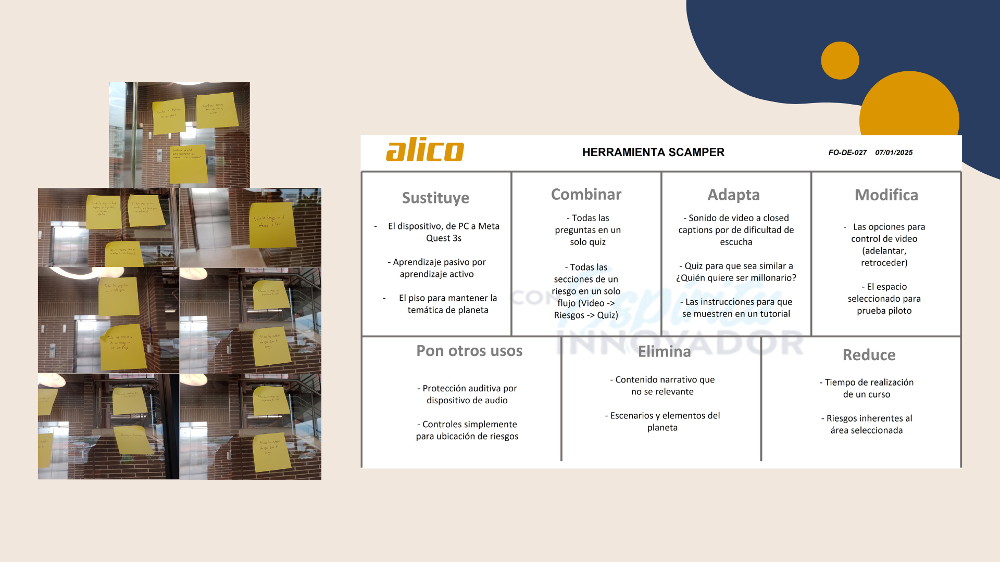
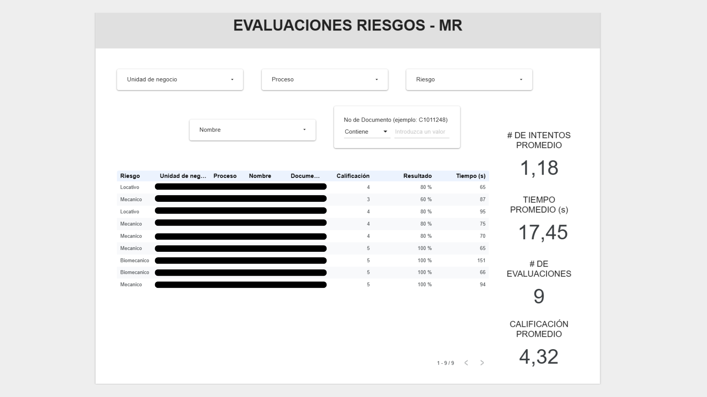

## El contexto

En Alico, los operarios son el 65% del personal, y su capacitación se hacía
con charlas y talleres presenciales: métodos que interrumpen la producción,
exigen desplazarse fuera del área de trabajo y dependen del criterio de cada
instructor, con unas 10 horas anuales por operario. El área de innovación se
preguntó si la realidad extendida podía replantear ese modelo, y ese fue mi
proyecto de práctica: responder la pregunta con método, no con intuición.

## La decisión de diseño clave

Invertir el desplazamiento: en lugar de llevar al operario a la capacitación,
llevar la capacitación al puesto de trabajo con un visor Meta Quest 3s. Y en
lugar de crear contenido desde cero, adaptar un curso que ya existía y
funcionaba: "Planeta SST", de la plataforma de aprendizaje de la empresa. La
transformación fue pasar de un aprendizaje pasivo (ver videos en un PC) a uno
activo e inmersivo.

:::figura{ancho ampliar}

Página de la guía metodológica entregada a la organización, donde se detallan las instrucciones de uso seguro y configuración de las gafas Meta Quest 3s en planta.
:::

## El proceso

Seguí el ciclo completo de Design Thinking, usando la caja de herramientas
del área de innovación:

**Empatizar.** Entrevistas semiestructuradas con los equipos de Seguridad y
Salud en el Trabajo, Aprendizaje y Desarrollo, y TPM.

**Definir.** Los hallazgos se sintetizaron en focos de resonancia: llevar la
formación al puesto para no frenar la producción, estandarizar los contenidos
y mantener las sesiones breves y flexibles. La matriz de riesgos de la
empresa mostró que 374 de los 569 riesgos identificados pertenecían a las
categorías elegidas para el prototipo: el alcance no fue arbitrario.

**Idear.** Con la técnica SCAMPER se definieron las transformaciones del
curso: del PC al visor, del aprendizaje pasivo al activo, quiz unificado con
dinámica de concurso, subtítulos por la dificultad de escucha en planta.

:::figura{ancho ampliar}

Formato SCAMPER de la caja de herramientas de innovación de Alico junto a las notas de ideación en campo, utilizadas para transformar el curso tradicional de PC a realidad virtual.
:::

**Prototipar.** Prototipo de media fidelidad en Unity: los personajes de
riesgos del curso original (riesgo locativo, carga física, riesgo mecánico)
viven ahora en un entorno inmersivo con video real de la planta, quiz
interactivo, un dashboard de seguimiento en Looker Studio y automatización
de datos con n8n.

:::figura{ancho ampliar}

Personajes de riesgo del curso original adaptados al entorno inmersivo (izquierda) y la interfaz de desarrollo en Unity del escenario virtual (derecha).
:::

**Validar.** Recorrido del prototipo con 9 colaboradores de la empresa,
evaluado con la misma encuesta de satisfacción de la plataforma de
aprendizaje corporativa.

## El resultado

El minicurso se completa en 5 minutos en promedio. La calificación promedio
de las evaluaciones fue **4.32** y la satisfacción general, **4.9/5**. Todos los
participantes estuvieron totalmente de acuerdo en que el curso fue práctico
y entendible, y 8 de cada 9 en que la navegación fue simple. El proyecto
cerró con la entrega de la guía metodológica: un documento que orienta cómo
implementar realidad extendida en las capacitaciones de la organización, más
allá de este prototipo.

:::figura{ancho ampliar}

Dashboard en Looker Studio generado a partir de las automatizaciones con n8n, mostrando las calificaciones de los participantes y el promedio de 4.32 alcanzado en las pruebas.
:::

:::video{youtube="EM_7Clp5BJc" titulo="Prototipo de capacitación en Realidad Virtual — Planeta SST"}

Demostración del prototipo inmersivo de Planeta SST en realidad virtual desarrollado para los visores Meta Quest 3s.
:::

## Lo que aprendí

Este proyecto me permitió poner en práctica, en un entorno organizacional con
retos reales, todo lo aprendido en la carrera: investigación de usuario,
prototipado, pensamiento disruptivo. Y me dio claridad sobre el tipo de proyectos
en los que quiero seguir creciendo: donde la investigación y la tecnología se
encuentran para cambiar cómo trabaja la gente.
