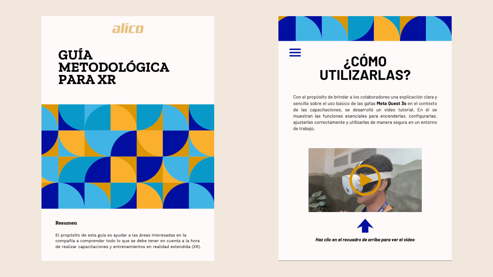

## Le contexte

Chez Alico, les opérateurs représentent 65 % du personnel, et leur formation se
faisait par des causeries et des ateliers en présentiel : des méthodes qui
interrompent la production, obligent à se déplacer hors de la zone de travail
et dépendent du jugement de chaque formateur, pour environ 10 heures par an et
par opérateur. L’équipe d’innovation s’est demandé si la réalité étendue
pouvait repenser ce modèle, et ce fut mon projet de stage : répondre à la
question avec une méthode, pas avec l’intuition.

## La décision de conception clé

Inverser le déplacement : au lieu d’amener l’opérateur à la formation, amener
la formation au poste de travail avec un casque Meta Quest 3s. Et au lieu de
créer un contenu de zéro, adapter un cours qui existait déjà et qui
fonctionnait : « Planeta SST », de la plateforme d’apprentissage de
l’entreprise. La transformation a consisté à passer d’un apprentissage passif
(regarder des vidéos sur un PC) à un apprentissage actif et immersif.

:::figura{ancho ampliar}

Page du guide méthodologique remis à l’organisation, détaillant les instructions d’utilisation sécurisée, de configuration et d’initiation au casque Meta Quest 3s pour les opérateurs.
:::

## Le processus

J’ai suivi le cycle complet du Design Thinking, en utilisant la boîte à outils
de l’équipe d’innovation :

**Empathiser.** Entretiens semi-directifs avec les équipes de Santé et Sécurité
au Travail, d’Apprentissage et Développement, et de TPM.

**Définir.** Les constats ont été synthétisés en axes de résonance : amener la
formation au poste pour ne pas freiner la production, standardiser les contenus
et garder des sessions courtes et flexibles. La matrice des risques de
l’entreprise a montré que 374 des 569 risques identifiés appartenaient aux
catégories retenues pour le prototype : le périmètre n’a pas été arbitraire.

**Imaginer.** Avec la technique SCAMPER, les transformations du cours ont été
définies : du PC au casque, de l’apprentissage passif à l’apprentissage actif,
un quiz unifié avec une dynamique de jeu télévisé, des sous-titres à cause de
la difficulté d’écoute en usine.

:::figura{ancho ampliar}

Modèle officiel SCAMPER de la boîte à outils d’innovation d’Alico aux côtés des photographies d’idéation sur le terrain, détaillant l’adaptation des contenus, les sous-titres en raison du bruit en usine et la ludification.
:::

**Prototyper.** Prototype de fidélité moyenne sous Unity : les personnages de
risques du cours d’origine (risque lié aux locaux, charge physique, risque
mécanique) vivent désormais dans un environnement immersif avec de vraies
images de l’usine, un quiz interactif, un tableau de bord de suivi dans Looker
Studio et l’automatisation des données avec n8n.

:::figura{ancho ampliar}

Adaptation des trois personnages de risques du cours d’origine « Planeta SST » (à gauche) et l’interface de l’éditeur Unity avec la scène virtuelle désertique développée pour le casque (à droite).
:::

**Valider.** Parcours du prototype avec 9 collaborateurs de l’entreprise,
évalué avec la même enquête de satisfaction que la plateforme d’apprentissage
de l’entreprise.

## Le résultat

Le mini-cours se termine en 5 minutes en moyenne. La note moyenne aux
évaluations a été de **4,32** et la satisfaction générale, de **4,9/5**. Tous
les participants étaient tout à fait d’accord sur le fait que le cours était
pratique et compréhensible, et 8 sur 9 sur le fait que la navigation était
simple. Le projet s’est clos par la remise du guide méthodologique : un
document qui oriente la mise en œuvre de la réalité étendue dans les formations
de l’organisation, au-delà de ce prototype.

:::figura{ancho ampliar}

Tableau de bord interactif dans Looker Studio alimenté par des automatisations n8n, enregistrant les performances individuelles des 9 collaborateurs évalués et la note moyenne finale de 4,32/5.
:::

:::video{youtube="EM_7Clp5BJc" titulo="Prototype de formation en Réalité Virtuelle — Planeta SST"}

Démonstration du prototype immersif de Planeta SST en réalité virtuelle développé sous Unity pour les casques Meta Quest 3s.
:::

## Ce que j’ai appris

Ce projet m’a permis de mettre en pratique, dans un cadre organisationnel avec
de vrais défis, tout ce que j’ai appris pendant mes études : recherche
utilisateur, prototypage, pensée disruptive. Et il m’a donné de la clarté sur le type
de projets dans lesquels je veux continuer à grandir : là où la recherche et la
technologie se rencontrent pour changer la façon dont les gens travaillent.
